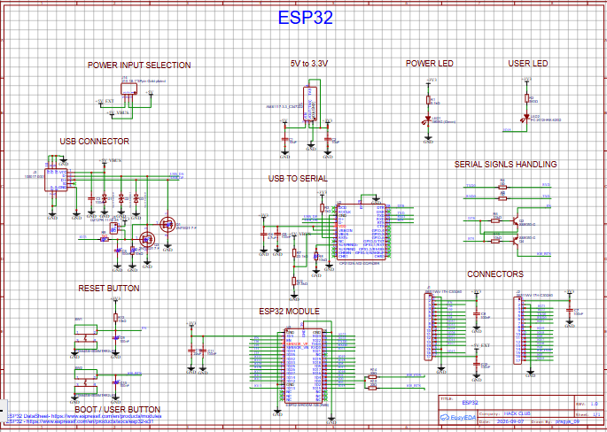
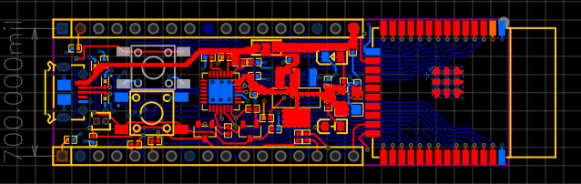
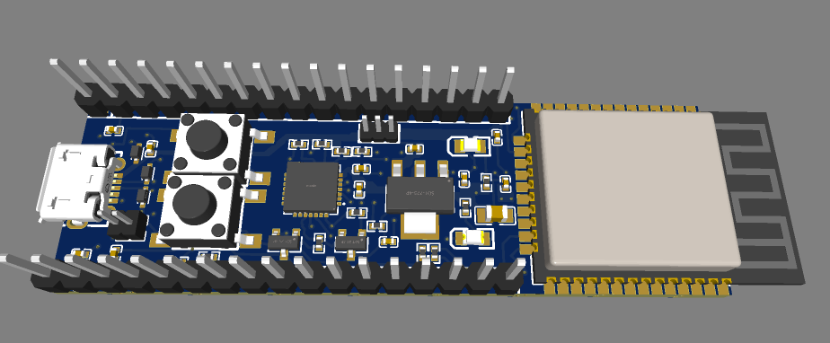
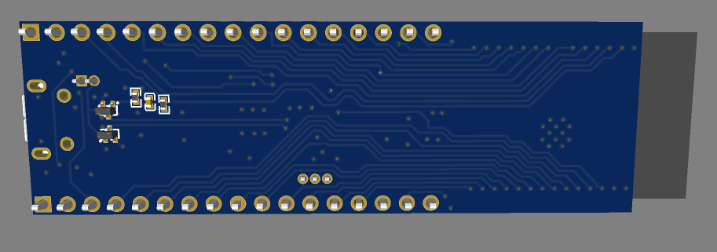

# September 8: started designing ESP32 PCB
I started working on my custom ESP32 PCB project in EasyEDA. I worked on the board layout and started placing the components required for the ESP32 development board. 

**Total time spend: 4 hours**

# September 9: Routing and PCB layout
I continue working on the PCB layout and routing. I connect the different section of the board ad worked on arranging the traces around the ESP32 and other components.

**Total time spend: 6 hours**

# September 10: Routing
again I continue work on routing.

**Total time spend: 1.5 hours**

# September 11: Routing and finishing
I finished the main PCB routing for the ESP32 board. I also check the board in the 3d view to make sure the components and overall board layout looked correct.

**Total time spend: 4.5 hours**

# WHAT I LEARNED 
During the project, I learned how to design and route a custom PCB in EasyEDA.
the project also helped me understand the difference between the PCB source/design file and the files that are required later for physical PCB manufacturing.............
